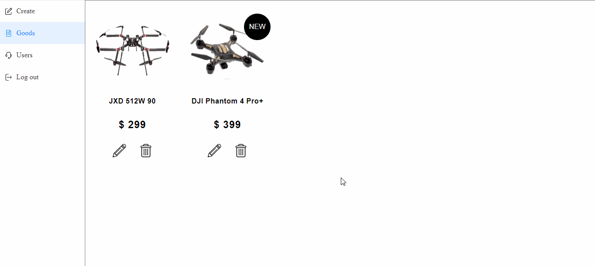
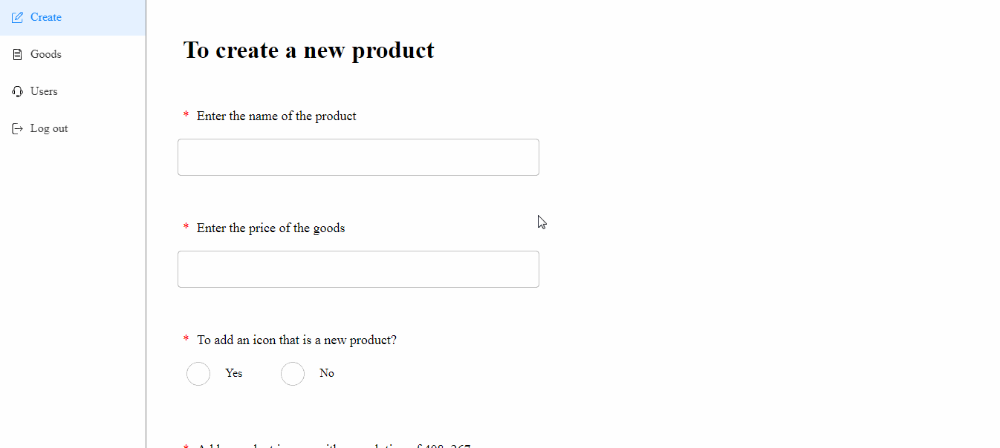
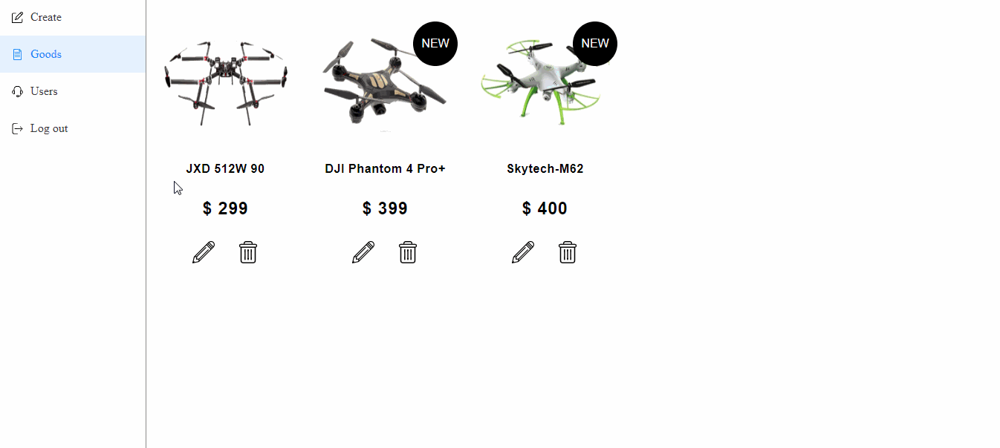

Некоммерческий проект [superdrone](https://nuxtjs-superdrone.herokuapp.com/)

Проект развернут на бесплатном хостинге [heroku](https://www.heroku.com/)  

При создании проекта, использовался стек технологий 
- NuxtJs (Vue) 
- NodeJs (express)
- mongoDB
- smart-grid 
- Sass

Так же использовались вспомогательные модули из npm, список который вы можете найти в **package.json**

## Почему NuxtJs? 
Проект создавался в ~~соляново~~ одиночку, а Nuxt дает возможность писать full-stack приложение. По мимо этого в нем используется подход формирования DOM на стороне сервера SSR (Server Side Rendering), что очень хорошо для SEO. 

## Smartgrid 
Да, я извращенец. Для адаптива использую его, так как он удобен. Описывать свойства css в классе, с использованием миксинов от Sass, мне кажется более удобным, нежели добавлять дополнительные классы к элементам (bootstrap). Вообще [smart-grid](https://github.com/dmitry-lavrik/smart-grid) штука очень крутая, и на мой взгляд недооцененная.

## Введение
Дизайн макет разрабатывался не мною, а взят из сети. 
Основной язык проекта - английский. 
Проект является лендингом, однако предусматривает в себе наличие страниц:
- Авторизации (Login)
- Корзины (Cart)
- Страницы с формой обратной связи
- Админской панели

Так же в проекте реализован подход SPA (single page application). То есть переход между разделами происходит без перезагрузки страницы. 
Имеется адаптивная верстка под разные экраны. От 340px до 1920px

## Функции
- проверка на реального пользователя, с помощью капчи

**Со стороны пользователя:**
- отображение покупателю выбранные им товары
- обеспечение возможности изменить свой не отправленный заказ
- отображение покупателю его статистической информации (кол-во заказов, товаров, сумма, и тд.);
- обеспечение управления "корзиной" — добавления в нее найденного товара, удаление
  позиции из нее, изменение количества товара в позиции и т.д.
- реализация обратной связи с покупателями через форму.

**Со стороны владельца**
- авторизация в панели администратора
- редактирование сущетсвующих товаров (названия, цены, картинки, добавление\удаления значка "NEW")
- добавление нового товара
- добавление нового пользователя

## Описание
**Home** 

 - Презентационный раздел
 
**Super Light Drone**

- Раздел с описанием дронов

**No name**

- Раздел со слайдером, в котором 2 видео. Макет предполагает наличие видео с дронами, но в связи
  с их отсутствием, вставлены видео на мой вкус :smile:
 
**Super Services**

- Описание возможностей

**The world's first seamless...**

- Описание характеристик дронов

**Mount to anything...**

- Слайдер с картинками

**Products**

 - Список продуктов
 
 **Contacts**
 - Раздел с контактами

**Cart**
- Содержит список выбранных товаров. Возможны
  операции по удалению текущих и добавлению новых позиций. Так же отображает предварительный
  расчет стоимости заказа.
  
**Login**
- Используется для аутентификации в панели администратора

## Описание панели администратора

Панель администратора содержит 3 подстраницы:

**Create**
- Подстраница с формой для создания нового товара

**Goods**
- Подстраница со списком товаров, которые можно редактировать

**Users**
- Подстранца с формой, для добавления нового пользователя для работы с панелью администратора

## Интересные задачи и их решения

**SSR**
  В отделе товаров, список продуктов берется с сервера, в момент когда вы только перешли на страницу [superdrone](https://superdrone-stewiebutthurt.herokuapp.com), формируется GET запрос на сервер, где формируется запрос в базу данных, откуда возвращается список товаров. После чего компонент Vue его отрисовывает. Но вот проблема, если мы будем использовать обычный Vue, то запрос к серверу будет происходить из вашего браузера, в момент формирования компонента. При таком раскладе, в исходном коде страницы, будет отсутствовать HTML разметка с товарами, а значит алгоритмы поисковиков не увидят список наших товаров (плохой SEO). Эту проблему решает Nuxt, он формирует DOM не на стороне клиента (из браузера) как обычный Vue,  а на стороне сервера. Тем самым запрос к БД произойдет перед формированием всей главной страницы, и в исходном коде будет присутствовать разметка с товарами (ура, поисковики видят наши товары).  

**Local Storage**
  В зависимости от задач, мы выбираем место где будем хранить временные данные. Мы можем хранить их в компонентах, во Vuex, или же использовать Local Storage. Когда мы перезагружаем страницу, весь её код отрабатывает заного, а значит и компоненты и стор от Vuex перезагрузятся вместе с ней. И если в них были временные данные, то они пропадут. Для того чтобы они не пропадали, мы будем записывать их в браузер, указывая сколько времени они должны там хранится. Для этого очень хорошо подходит готовый модуль из npm, который сочетает в себе Vuex и Local Storage.   Тем самым, мы можем без особого труда записывать данные, и они будут храниться указанное нами время. В моем случае это 1 час.
  
Теперь, когда мы будем заходить на страницу, будет происходить проверка, хранятся ли данные в браузере или там пусто. Если пусто, мы сделаем запрос к базе данных, если же в браузере что то есть, то мы возьмем данные от туда.
  
Так, стоп! Но что если мы выбрали товар, но в этот же момент цена в базе данных поменялась? Так как данные у нас из браузера, то они могут быть устаревшими. Выходит мы выбираем товар по одной цене, а на самом деле цена уже другая.  Так не пойдет.  
Поэтому, при заходе на страницу корзины, мы сверяем данные товаров корзины и бд. Если у них отличаются цены, то цена обновится.

**Хранение картинок в базе**
   У Heroku локальный диск является "эфемерным". Когда приложение "засыпает", его диск уничтожается, а когда "будят" содается новый, отдельный на каждую машину. Из этого следует, что добавлять картинки с помощью панели администратора в файловую систему Heroku мы не сможем. Поэтому в моем случае картинки кодируются в base64 на сервере, после записываются в виде строки в базу данных.
